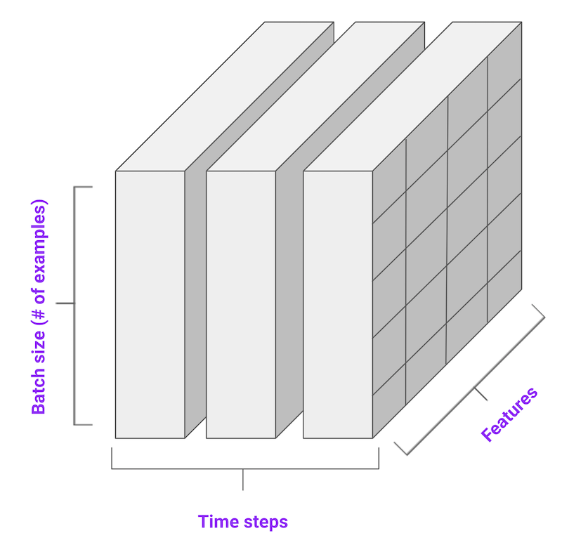
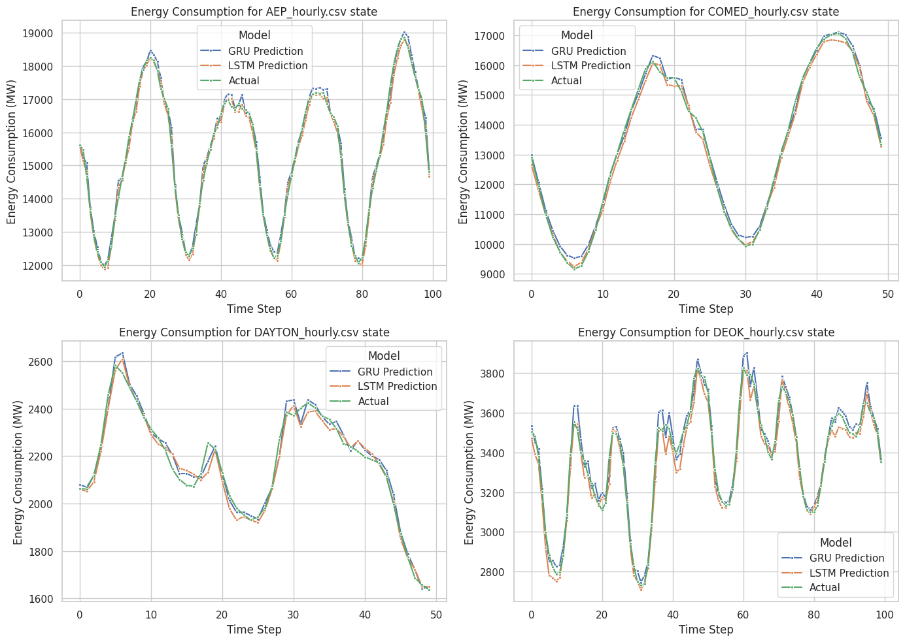

# 🔋 Energy Consumption Prediction with LSTM/GRU Networks

[](https://www.python.org/downloads/)
[](https://pytorch.org/)
[](https://python-poetry.org/)

> A deep learning project for hourly energy consumption prediction using LSTM and GRU neural networks implemented in PyTorch.

## 🎯 Overview

This project implements time series forecasting models to predict hourly energy consumption using historical data from the PJM Interconnection LLC. The system compares the performance of two recurrent neural network architectures:

- **LSTM (Long Short-Term Memory)** - Advanced RNN with sophisticated gating mechanisms
- **GRU (Gated Recurrent Unit)** - Simplified RNN architecture with fewer parameters

The models are trained on historical energy consumption data across different U.S. regions and can predict the next hour's energy usage with high accuracy.

### 🌟 Key Features

- ⚡ **Dual Architecture Comparison**: LSTM vs GRU performance analysis
- 📊 **Multi-Region Support**: Handles data from multiple U.S. energy regions
- 🔧 **Configurable Parameters**: Easy model tuning via YAML configuration
- 📈 **Comprehensive Evaluation**: sMAPE metrics and visualization tools
- 🚀 **Production Ready**: Clean, modular code structure

## 🏗️ Architecture

### Model Architecture

Both LSTM and GRU models follow the same general structure:

```
Input Layer (5 features) → RNN Layer (LSTM/GRU) → Dense Layer → Output (1 prediction)
```

### Network Classes

The project implements two main neural network classes in [`src/fct.py`](src/fct.py):

- **`GRUNet`**: GRU-based recurrent neural network
- **`LSTMNet`**: LSTM-based recurrent neural network

## 📊 Dataset

The project uses the [PJM Interconnection LLC Energy Consumption Dataset](https://www.kaggle.com/robikscube/hourly-energy-consumption) from Kaggle, which contains:

- **Temporal Coverage**: Hourly energy consumption data
- **Geographic Coverage**: Multiple U.S. regions (AEP, COMED, DAYTON, DEOK, DOM, DUQ, EKPC, FE, NI, PJME, PJMW)
- **Data Format**: CSV files with datetime and consumption values
- **Size**: Thousands of hourly measurements per region



### Data Preprocessing Pipeline

1. **Feature Engineering**: Extract temporal features (hour, day, month, etc.)
2. **Normalization**: MinMax scaling to [0,1] range
3. **Windowing**: Create sliding windows of 90 timesteps
4. **Train/Test Split**: 90% training, 10% testing per region

## 🚀 Quick Start

### Prerequisites

- Python 3.12+
- Poetry (for dependency management)

### Installation

1. **Clone the repository**
   ```bash
   git clone https://github.com/BriacLeGuilloux/energy_consumption_prediction-master.git
   cd energy-consumption-prediction
   ```

2. **Install dependencies with Poetry**
   ```bash
   # Install Poetry if you haven't already
   curl -sSL https://install.python-poetry.org | python3 -

   # Install project dependencies
   poetry install
   ```

3. **Activate the virtual environment**
   ```bash
   poetry shell
   ```

4. **Download the dataset**
   - Visit [Kaggle PJM Dataset](https://www.kaggle.com/robikscube/hourly-energy-consumption)
   - Download all CSV files
   - Place them in the `data/raw/` directory


## 📁 Project Structure

```
energy-consumption-prediction/
├── 📁 data/
│   ├── 📁 raw/                 # Raw CSV files from Kaggle
│   └── 📁 processed/           # Processed data (generated)
├── 📁 imgs/                    # Documentation images
├── 📁 models/                  # Saved model weights
│   ├── gru_model.pt           # Trained GRU model
│   └── lstm_model.pt          # Trained LSTM model
├── 📁 src/                     # Source code
│   ├── config.yaml            # Configuration parameters
│   ├── fct.py                 # Model classes and utilities
│   ├── eda_prep_train.ipynb   # Training notebook
│   └── evaluate_plot.ipynb    # Evaluation notebook
├── pyproject.toml             # Poetry dependencies
├── poetry.lock                # Locked dependencies
└── README.md                  # This file
```

### Key Files

- **[`src/config.yaml`](src/config.yaml)**: Configuration parameters for training and evaluation
- **[`src/fct.py`](src/fct.py)**: Core model classes (`GRUNet`, `LSTMNet`) and utility functions
- **[`src/eda_prep_train.ipynb`](src/eda_prep_train.ipynb)**: Data exploration, preprocessing, and model training
- **[`src/evaluate_plot.ipynb`](src/evaluate_plot.ipynb)**: Model evaluation and results visualization


## 📈 Usage

### 1. Training Models

Open and run [`src/eda_prep_train.ipynb`](src/eda_prep_train.ipynb):

```bash
jupyter notebook src/eda_prep_train.ipynb
```

This notebook will:
- Load and preprocess the data
- Create sliding windows for time series
- Train both GRU and LSTM models
- Save trained models to `models/` directory

### 2. Evaluating Models

Open and run [`src/evaluate_plot.ipynb`](src/evaluate_plot.ipynb):

```bash
jupyter notebook src/evaluate_plot.ipynb
```

This notebook will:
- Load pre-trained models
- Evaluate performance on test data
- Generate prediction visualizations
- Calculate sMAPE (Symmetric Mean Absolute Percentage Error)


## 🔬 Results

### Performance Comparison

Both models achieve excellent performance on the energy consumption prediction task:

| Model | sMAPE | Training Speed | Parameters |
|-------|-------|----------------|------------|
| GRU   | 0.541 | 11s            | Fewer      |
| LSTM  | 0.352 | 19s            | More       |


### Key Findings

- **GRU Advantages**: Faster training, fewer parameters, similar accuracy
- **LSTM Advantages**: Potentially better long-term memory retention
- **Overall**: Both models successfully capture energy consumption patterns and cyclical trends

### Sample Predictions



The models demonstrate strong performance in:
- ✅ **Trend Following**: Accurately tracking consumption patterns
- ✅ **Cyclical Recognition**: Capturing daily and seasonal cycles  
- ✅ **Peak Prediction**: Identifying consumption peaks and valleys
- ⚠️ **Lag Handling**: Minor delays in predicting sudden changes


## 📚 References

### Academic Papers
- [Understanding LSTM Networks](https://colah.github.io/posts/2015-08-Understanding-LSTMs/) - Christopher Olah
- [Empirical Evaluation of Gated Recurrent Neural Networks](https://arxiv.org/abs/1412.3555) - Chung et al.

### Documentation
- [PyTorch LSTM Documentation](https://pytorch.org/docs/stable/nn.html#torch.nn.LSTM)
- [PyTorch GRU Documentation](https://pytorch.org/docs/stable/nn.html#torch.nn.GRU)
- [PJM Interconnection](https://www.pjm.com/) - Energy market operator

### Dataset
- [Hourly Energy Consumption Dataset](https://www.kaggle.com/robikscube/hourly-energy-consumption) - Kaggle


## 👨‍💻 Author

**Briac Le Guillou**
- GitHub: [@BriacLeGuilloux](https://github.com/BriacLeGuilloux)

---

⭐ **Star this repository if you found it helpful!**

*Built with ❤️ using PyTorch and Python*
